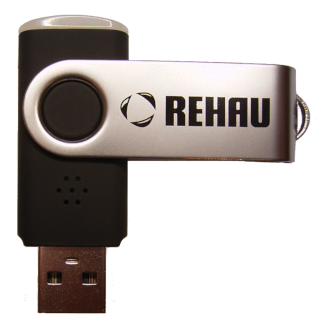

# ioBroker.voc-monitor

## VOC-monitor adapter for ioBroker
(German version see below)

This Adapter supports the VOC sensor with USB ID 03eb:2013, it can be found under different product names. E.g. [USB indoor air monitor](https://ams.com/iam), [REHAU Raumluftsensor](https://www.rehau.com/de-de/raumluftsensor), [Velux Raumluftfühler](https://www.velux.de/produkte/lueftungsloesungen-belueftung/raumluftfuehler) or Voltcraft CO-20.

The program part for reading the data from the VOC sensor in the ioBroker-adapter base on code by [mrtoto](https://github.com/toto/iam-voc-monitor).   

If the VOC sensor is connected directly to a USB port of the ioBroker-server, the user “iobroker” has to be granted write permission to this USB device

**It is unknown to me, how Windows manages permissions of USB devices, so I can not say anything about the possibility of integrating the VOC sensor under Windows.**

Under linux a udev rule must be created as follows:
Create a file named “90-voc-monitor_iobroker.rules“ in folder /etc/udev/rules.d/ with following content (root permission required):

    SUBSYSTEMS=="usb", ATTRS{idVendor}=="03eb", ATTRS{idProduct}=="2013", GROUP="iobroker"

Alternative copy the file “90-voc-monitor_iobroker.rules “ from folder “rules_and_tools” (root permission required)

This rule automatically assigns the USB-Device with ID 03eb:2013  to the group “iobroker” when plugged in.

In addition, you can also connect sensors to other computers, e.g. Raspberry Pi Zero W.
The sensor is then read out by means of a small python program and the measurement data is sent to the iobroker-server via network.

Therefore you have to activate the selection “VOC-monitor connected via udp-client” in the adapter config.
The default settings IP-Address (0.0.0.0) and Port (44444) can usually be retained and only have to be adjusted in special cases (see below).

**IP-Address:**  
If the iobroker server has more than one IP address available, but it should only be listened to one of them, this specific IP address can be entered here.

**Port:**   
If another ioBroker adapter or application on the ioBroker-server or on the udp-client-computer already uses the udp port 44444, a different port number can be set here. Of course it has to be adjusted on the client computer as well!

**Setting up the udp-client, see [udp_client_README.md](https://github.com/bowao/ioBroker.voc-monitor/blob/master/rules_and_tools/udp_client_README.md)**

----

## VOC-monitor adapter für ioBroker

Der Adapter unterstützt den VOC-Sensor mit der USB Id 03eb:2013, dieser ist unter verschiedenen Produktnamen im Handel zu finden.
Z.B. [USB indoor air monitor](https://ams.com/iam), [REHAU Raumluftsensor](https://www.rehau.com/de-de/raumluftsensor), [Velux Raumluftfühler](https://www.velux.de/produkte/lueftungsloesungen-belueftung/raumluftfuehler) oder Voltcraft CO-20.

Der Programmteil zum lesen der Daten vom VOC-Sensor im ioBroker-Adapter basiert auf dem Code von [mrtoto](https://github.com/toto/iam-voc-monitor).   

Wird der VOC-Sensor direkt an einen USB-Port des ioBroker-Servers angeschlossen, so müssen dem Benutzer "iobroker" Schreibrechte auf dieses USB-Gerät erteilt werden.

**Wie Windows die Rechte der USB-Geräte verwaltet ist mir nicht bekannt, daher kann ich keine Aussage über die Möglichkeit der Einbindung des VOC-Sensors unter Windows machen.**

Unter Linux muss dafür wie folgt eine udev-Regel erstellt werden:

Im Verzeichnis "/etc/udev/rules.d/" eine Datei mit dem namen "90-voc-monitor_iobroker.rules" mit folgendem Inhalt anlegen (root Rechte erforderlich):

	SUBSYSTEMS=="usb", ATTRS{idVendor}=="03eb", ATTRS{idProduct}=="2013", GROUP="iobroker"

Alternativ kann die Datei "90-voc-monitor_iobroker.rules" aus dem Ordner "rules_and_tools" kopiert werden (root Rechte erforderlich).

Durch diese Regel wird dem USB Gerät mit der ID 03eb:2013 beim Einstecken die Gruppe "iobroker" automatisch zugewiesen.

Zusätzlich hat man die Möglichkeit den VOC-Sensor an andere Rechner, z.B. an einem Raspberry Pi Zero W anzuschließen. 
Der VOC-Sensor wird dann mittels eines kleinen Python Programms auf dem Client-Rechner ausgelesen und die Messdaten werden über Netzwerk an den ioBroker-Server gesendet.
Dazu kann man in der Adapter-Config die Auswahl "VOC-Monitor über udp-client verbunden" aktivieren.
Die Standard-Einstellungen bei der IP-Adresse (0.0.0.0) und beim Port (44444) können in der Regel beibehalten werden und müssen nur in speziellen Fällen (siehe unten) angepasst werden.

**IP-Adresse:**  
Falls dem iobroker-Server mehrere IP-Adressen zur Verfügung stehen und nur auf einer gelauscht werden soll, kann diese IP-Adresse hier eingetragen werden.

**Udp-Port:**  
Falls ein anderer ioBroker-Adapter oder eine andere Anwendung auf dem Rechner den udp-Port 44444 bereits belegt, kann hier ein anderer Port eingestellt werden. Dieser muss dann natürlich am Client-Rechner ebenfalls angepasst werden!

**Einrichten des udp-Client, siehe [udp_client_README.md](https://github.com/bowao/ioBroker.voc-monitor/blob/master/rules_and_tools/udp_client_README.md)**

## Changelog
### 1.0.0
* (bowao) initial release

## License
MIT License

Copyright (c) 2020 bowao <cryolab@web.de>

Permission is hereby granted, free of charge, to any person obtaining a copy
of this software and associated documentation files (the "Software"), to deal
in the Software without restriction, including without limitation the rights
to use, copy, modify, merge, publish, distribute, sublicense, and/or sell
copies of the Software, and to permit persons to whom the Software is
furnished to do so, subject to the following conditions:

The above copyright notice and this permission notice shall be included in all
copies or substantial portions of the Software.

THE SOFTWARE IS PROVIDED "AS IS", WITHOUT WARRANTY OF ANY KIND, EXPRESS OR
IMPLIED, INCLUDING BUT NOT LIMITED TO THE WARRANTIES OF MERCHANTABILITY,
FITNESS FOR A PARTICULAR PURPOSE AND NONINFRINGEMENT. IN NO EVENT SHALL THE
AUTHORS OR COPYRIGHT HOLDERS BE LIABLE FOR ANY CLAIM, DAMAGES OR OTHER
LIABILITY, WHETHER IN AN ACTION OF CONTRACT, TORT OR OTHERWISE, ARISING FROM,
OUT OF OR IN CONNECTION WITH THE SOFTWARE OR THE USE OR OTHER DEALINGS IN THE
SOFTWARE.
